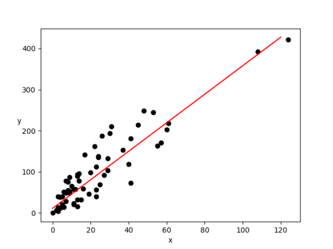

### Comparison between sklearn and from scracth coded funcs

Output

Shape: (63, 2)  
Corr:  (0.9128782350234065, 2.0466378449524473e-25)  
Simple regression  
intercept: 11.184737873348638  
slope: 3.46902946250411  
rmse: 47.285345082760124  
r2: 0.4413613356352726  

sklearn regression  
intercept: [11.18473787]  
slope: [3.46902946]  
r2 of model: -44.213550307674105  
r2 from metrics package: 0.4413613356352726  
mse: 2235.903859595707  
exp_var: 0.548083062335446  

Scatter:

